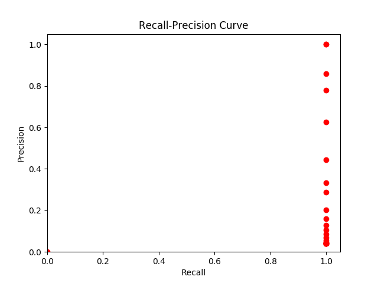

### Competiotion Final Results

[Keyword Spotting Test results](src/main/py/kws/data/test-spotting_results.txt)
[Molecules Test results](src/main/py/mol/test-data/predicted.txt)

### Group Task #4 - Molecules
Classification of molecules struction into two classes: 'inactive', 'acctive'

##### Approach
##### Moleciule presentation
##### Bipartite 

### Group Task #3 - Keyword Spotting
Identification of given keywords in historical documents written by George Washington

##### Two-step approach
##### Preprocessing (main.py)
- reading transcription file (separating positional IDs and literal words)
- binarizing page images
- extracting word positions (svg polygons and bounding boxes)
- extracting word images
- resizing word images (to median width and height of all extracted word images)

##### Feature extraction and analysis (main_dtw.py)
- feature extraction for each word (number of black_pixels, upper boundary, lower boundary, black_white_transitions, percentage of black pixels (between upper and lower bound, in center half, in lower third, in lower quarter, in upper third))
- distance calculation and dynamic time warping: keywords vs. known words
- calculation of precision and recall
- graphical representation

[Sample result file - containing top hit only thresholded with 6.0 dtw distance (Euclidean)](src/main/py/kws/data/main_dtw.out)

Interpretation of the Recall-Precision curve only on top hits at all validation set locations and thresholded stepwise in the range from 4.0 to 9.0 dtw distance (Euclidean). Either the plot is wrongly generated or we have a problem with False-Positive values or both.

[Result keywords DTW distance matrix at all validation set locations](/src/main/py/kws/data/spotting_results.txt)

***************************************************
### Group Task #2 - Machine learning

[Source Code for task 2a SVM](src/main/py/svm/svm_1.0.py)

[SVM model output on the ful dataset](src/main/py/svm/svm_results_full_dataset.txt)

[SVM model output on the reduced dataset](src/main/py/svm/svm_parmaters.txt)

[Source Code for task 2b MLP](src/main/py/mlp/mlpMNIST.py)

final accuracy (testing) on task 2b : 97.46%

[Source Code for task 2c CNN](src/main/py/cnn/model_task2c.py)
final accuracy (testing) on task 2c : 99.64% 

Here you can find the detailed output from this run:
[output of CNN model run with optimal parameters](src/main/py/cnn/CNN_model_optimal_parameters.txt)

To find the optimal parameters we run a grid search on range of parameters and here is the result:
[Grid Search report on CNN model parameters](src/main/py/cnn/CNN_test_report.csv)

[Source Code for task 2d CNN on the permutated MNIST](src/main/py/cnn/model_task2d.py)
final accuracy (testing) on task 2d (MLP) : 95.01%

[Source Code for task 2d MLP on the permutated MNIST](src/main/py/mlp/mlpPermutMNIST.py)
final accuracy (testing) on task 2d (CNN) : 99.43%

To find a set of optimal parameters we run a grid search: [Grid search report on MLP model parameters](src/main/py/mlp/MLP_test_parameters_report.csv)

conclusions on 2d :
the network seems to perform quite as well when the data is permuted as when it is not. This probably is because it sees patterns that are not "visible" to us (they are, we are just bad at spotting them), since the data is always permutated in the same way (thus the dataset has as much information as before, it's just ordered differently).

In the end, a network deals with this type of permutations easily if it's fully connected (it has an input node for each pixel, order doesn't really matter here). It performs slightly worse if it's a cnn, maybe because some features, like straight lines, become more complex to encode.
